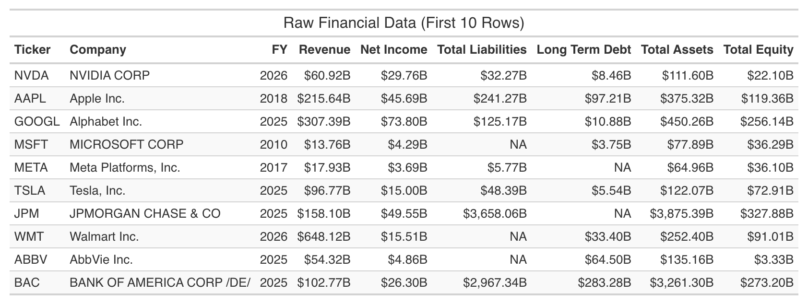
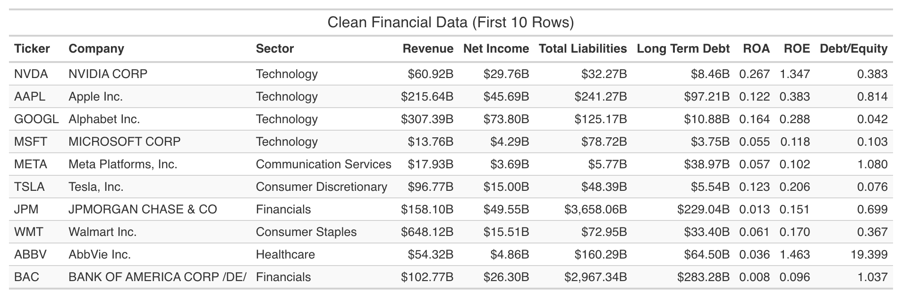
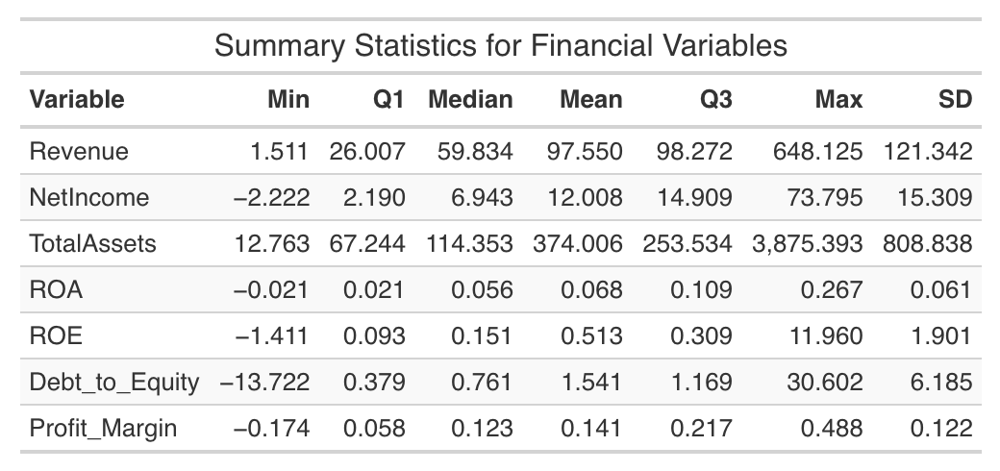
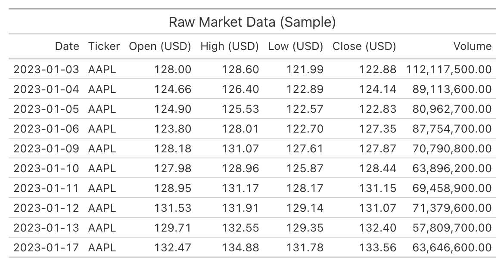
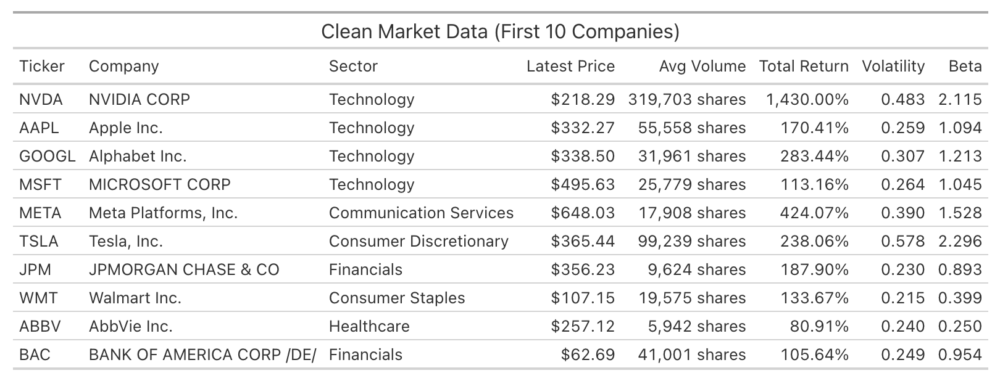

# Company Finacial Data

## Data Sources

The primary dataset comes from the **U.S. Securities and Exchange Commission (SEC) EDGAR** system, using the **CompanyFacts API**. This API provides standardized XBRL financial statement data for publicly traded companies without requiring an API key. 40 large companies were selected across eight sectors to ensure diversity.

Other data sources (macroeconomic indicators, market data, news sentiment) will be added in subsequent steps.

## Data Collection & API

This dataset provides the fundamental measures of performance (e.g., profitability, leverage, liquidity). Python was used to connect with the SEC API.  The script performs the following steps:

1. Fetch the official company ticker → CIK mapping from `company_tickers.json`.
2. Select a list of tickers (40 companies).
3. For each company, call the CompanyFacts endpoint:  
   `https://data.sec.gov/api/xbrl/companyfacts/CIK{cik}.json`
4. Extract key US-GAAP financial metrics from the latest 10-K filing.
5. Compute derived ratios (ROA, ROE, debt-to-equity, profit margin).
6. Save raw and clean CSV files.

**API endpoint example:**  
`https://data.sec.gov/api/xbrl/companyfacts/CIK0000320193.json`  
(where `0000320193` is the CIK for Apple Inc.)

**See the full Python code:** [`code/company_financials.py`](code/company_financials.py)

## Raw Data

The raw data, exactly as returned by the SEC API, is stored in:

- [`company_financials_raw.csv`](data/raw/company_financials_raw.csv)

This file contains one row per company (latest fiscal year) with some missing financial values and information as shown in the preview below. 

### Raw Data Preview



## Data Preparation

Cleaning and transformation steps performed in Python:

- Converted numeric columns to float.
- **Imputed missing values** in financial columns using the **sector median** (with global median as fallback).
- Computed derived metrics:
  - **ROA** = Net Income / Total Assets
  - **ROE** = Net Income / Total Equity
  - **Debt-to-Equity** = Long-Term Debt / Total Equity
  - **Profit Margin** = Net Income / Revenue
- Added a sector column based on ticker (manual mapping).

The clean dataset is stored in:

- [`company_financials_clean.csv`](data/clean/company_financials_clean.csv)

A preview is shown below

### Clean Data Preview



## Exploratory Data Analysis

```{r}
#| label: setup-eda
#| echo: false
#| message: false
#| warning: false
library(readr)
library(dplyr)
library(ggplot2)
library(scales)

fin <- read_csv("data/clean/company_financials_clean.csv", show_col_types = FALSE)
```

### Summary statistics



### Distribution of ROA by sector

```{r}
#| label: roa-by-sector
#| fig-cap: "Return on Assets by Sector"
#| fig-width: 8
#| fig-height: 5
fin %>%
  ggplot(aes(x = reorder(sector, ROA, FUN = median), y = ROA, fill = sector)) +
  geom_boxplot() +
  coord_flip() +
  labs(x = "Sector", y = "Return on Assets", title = "ROA Distribution by Sector") +
  theme_minimal() +
  theme(legend.position = "none")
```

### Revenue vs. Net Income

```{r}
#| label: rev-vs-netincome
#| fig-cap: "Revenue vs Net Income (signed square root scale)"
#| fig-width: 10
#| fig-height: 7

signed_sqrt <- trans_new("signed_sqrt",
  transform = function(x) sign(x) * sqrt(abs(x)),
  inverse = function(x) sign(x) * x^2,
  domain = c(-Inf, Inf)
)

fin %>%
  ggplot(aes(x = Revenue, y = NetIncome, color = sector)) +
  geom_point(size = 3, alpha = 0.7, position = position_jitter(width = 0.02, height = 0.02)) +
  scale_x_continuous(trans = signed_sqrt, labels = dollar_format(scale = 1e-9, suffix = "B")) +
  scale_y_continuous(trans = signed_sqrt, labels = dollar_format(scale = 1e-9, suffix = "B")) +
  labs(x = "Revenue (Signed Sqrt Scale, Billions)", y = "Net Income (Signed Sqrt Scale, Billions)", title = "Revenue vs. Net Income") +
  theme_minimal()
```

## Initial Findings

- The dataset contains **40 companies** across **8 sectors**.
- Missing values were imputed using sector medians, so all financial variables are now complete.
- ROA varies widely by sector; technology and healthcare often show higher ROA, while utilities and energy have lower ROA.
- There is a positive relationship between revenue and net income, as expected, but the spread suggests other factors (e.g., margins, industry) also matter.
- These initial observations set the stage for integrating additional data sources and building predictive models in later modules.

# Market Data

## Data Source & Collection

Market data was obtained from **Yahoo Finance** using the Python library `yfinance`. The daily OHLCV data was collected for the same 40 companies from **2023-01-01 to present**. For each company the following was computed:

- **Latest closing price**
- **Average daily trading volume**
- **Total return** over the period
- **Annualized volatility** (std of daily returns × √252)
- **Beta** relative to the S&P 500 index

The full Python script is here: [`code/market_data.py`](code/market_data.py)  
Raw data: [`market_data_raw.csv`](data/raw/market_data_raw.csv)
Clean data: [`market_data_clean.csv`](data/clean/market_data_clean.csv)

### Raw Market Data Preview



### Clean Market Data Preview



## Merging with Financial Data

The market metrics was combined with the financial data for further analysis.

```{r}
#| label: merge-market-fin
#| echo: false
#| message: false
#| warning: false
library(readr)
library(dplyr)

market <- read_csv("data/clean/market_data_clean.csv", show_col_types = FALSE)
fin <- read_csv("data/clean/company_financials_clean.csv", show_col_types = FALSE)

merged <- inner_join(fin, market, by = c("ticker", "company", "sector"))
```

### Volatility vs. ROA

```{r}
#| label: vol-vs-roa
#| fig-cap: "Volatility vs. Return on Assets"
#| fig-width: 8
#| fig-height: 5
merged %>%
  ggplot(aes(x = volatility, y = ROA, color = sector)) +
  geom_point(size = 3, alpha = 0.7) +
  labs(x = "Annualized Volatility", y = "Return on Assets", title = "Volatility vs. ROA") +
  theme_minimal()
```

### Beta vs. ROA

```{r}
#| label: beta-vs-roa
#| fig-cap: "Beta vs. Return on Assets"
#| fig-width: 8
#| fig-height: 5
merged %>%
  ggplot(aes(x = beta, y = ROA, color = sector)) +
  geom_point(size = 3, alpha = 0.7) +
  labs(x = "Beta", y = "Return on Assets", title = "Beta vs. ROA") +
  theme_minimal()
```

### Total Return by Sector

```{r}
#| label: return-by-sector
#| fig-cap: "Total Return by Sector"
#| fig-width: 8
#| fig-height: 5
merged %>%
  ggplot(aes(x = reorder(sector, total_return, FUN = median), y = total_return, fill = sector)) +
  geom_boxplot() +
  coord_flip() +
  labs(x = "Sector", y = "Total Return", title = "Total Return Distribution by Sector") +
  theme_minimal() +
  theme(legend.position = "none")
```